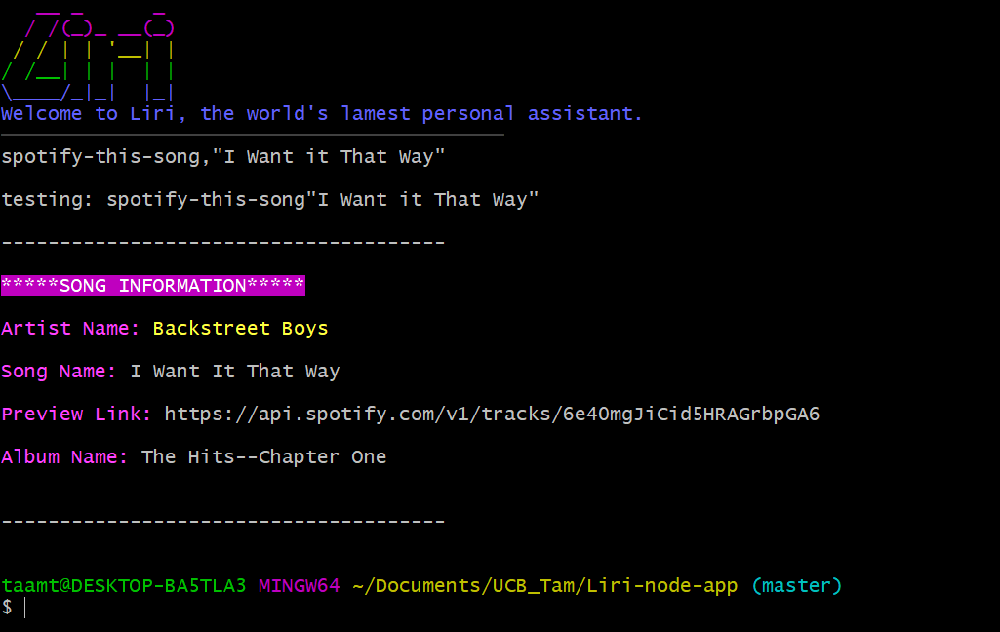

# Liri-node-app :blush:
<h3>Overview</h3> 
In this assignment, you will make LIRI. LIRI is like iPhone's SIRI. However, while SIRI is a Speech Interpretation and Recognition Interface, <strong>LIRI is a Language Interpretation and Recognition Interface.</strong> LIRI will be a command line node app that takes in parameters and gives you back data.

<h4>Make it so liri.js can take in one of the following commands:</h4>

   * <strong>`concert-this`</strong> output
   

   * <strong>`spotify-this-song`</strong> output
   
  
   * <strong>`movie-this`</strong> output
   *If the user doesn't type a movie in, the program will output data for the movie 'Mr. Nobody.'*
   
    
   

   * <strong>`do-what-it-says`</strong> output
   

<h3>Build with:</h3>
<ul>
<li>Visual Studio Code (https://code.visualstudio.com) - Text editor
<li>Javascript
<li>Node.js (https://nodejs.org/en) - Framework used
<li>JSON (http://www.json.org) - Data format used
 
   * [Node-Spotify-API](https://www.npmjs.com/package/node-spotify-api)

   * [Axios](https://www.npmjs.com/package/axios)

        *You'll use Axios to grab data from the [OMDB API](http://www.omdbapi.com) and the [Bands In Town API](http://www.artists.bandsintown.com/bandsintown-api)*

   * [Moment](https://www.npmjs.com/package/moment)

   * [DotEnv](https://www.npmjs.com/package/dotenv)
   * [Chalk](https://www.npmjs.com/package/chalk)
   
   
      
